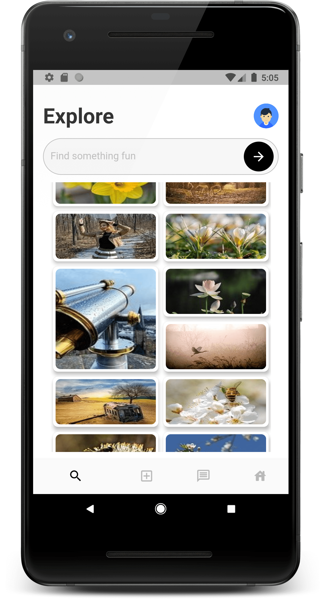

# pixabay-galllery-flutter

Used pixabay API
https://pixabay.com/api/docs/

## Flutter Gallery UI 
### Update your API key in the app file to run this sample app.
lib\APIHelper.dart file 

```sh
const API_KEY = "YOUR_API_TOKEN";
```

# ScreenShots
Wireframe: https://framer.com/share/Social-app-copy--ri68yLRs9gn2bFJSrXEh/H08WOJABs#H08WOJABs

       

